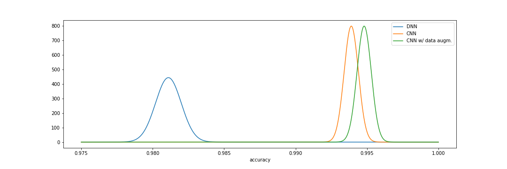

# Deep learning playground

A series of notebooks with experiments on neural networks using tensorflow.keras

## MNIST digits dataset, experiment results

## MNIST fashion dataset, experiment results

## License

This project is licensed under the **MIT License** - see the LICENSE.md file for details
